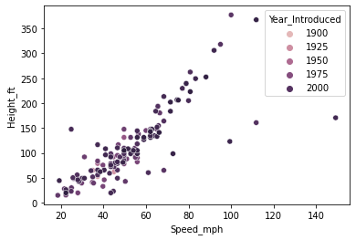

# Roller Coasters Data Analysis Project

- In this project, we'll be performing **exploratory analysis** using python and pandas on a roller coasters data set containing information such as location, name, speed, height etc.

## High Level Steps

- Data understanding - checking various metrics availablem nbumber of records, columns and their datatypes
- Data preperation - removing duplicates, changing column names, removing unecessary columns, changing column datatypes
- Feature understanding - Understanding characteristics of each feature (column)
- Feature relationships - Understanding how multiple feature relate to each other
- Data insights

## Files 

- **coaster_db.csv** - raw data file
- **main.ipynb** - python jupyter notebook file with all the code
- **complete** - folder containg a .md file which can show all the code and graphs with ease

### Rollercoaster speed vs height plot

### Rollercoaster speeds plot

### Rollercoaster numeric values correlation w.r.t each other

