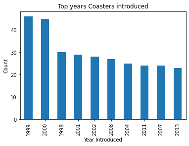
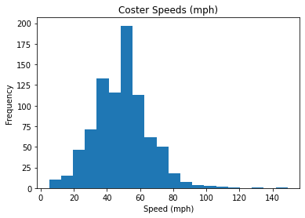
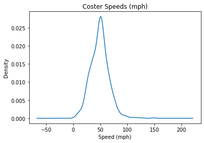
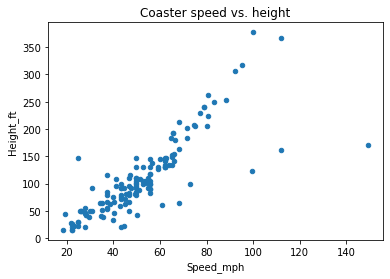
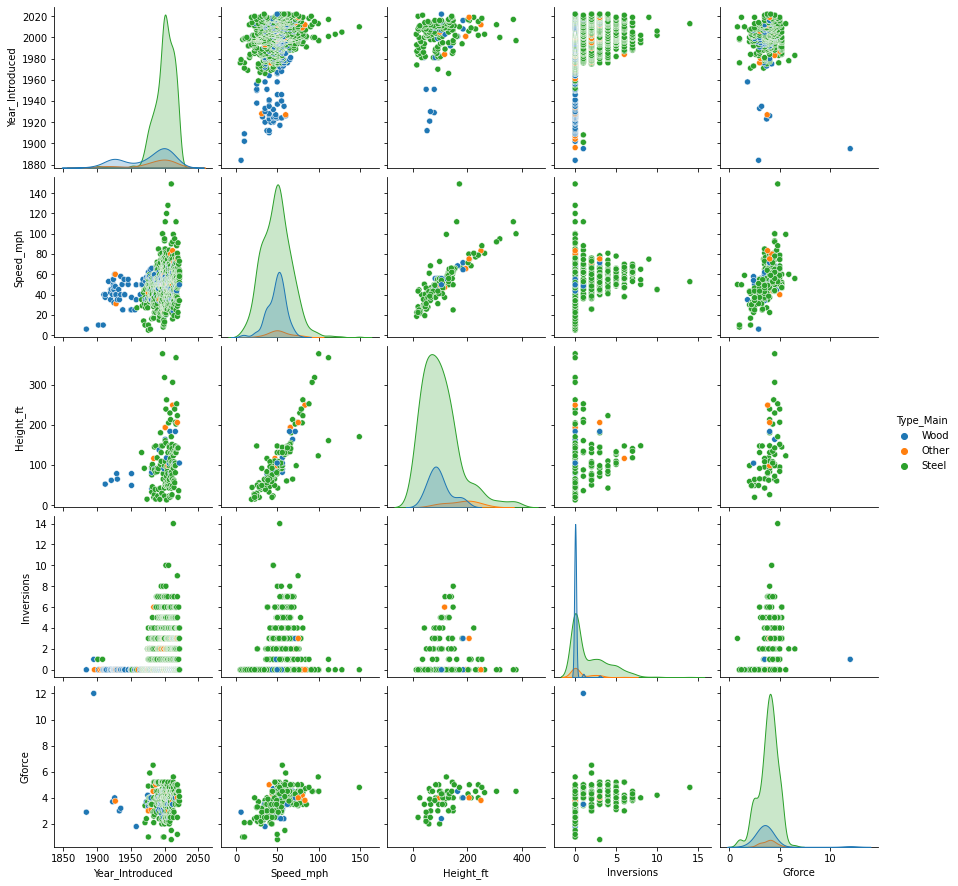
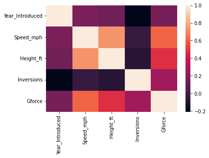
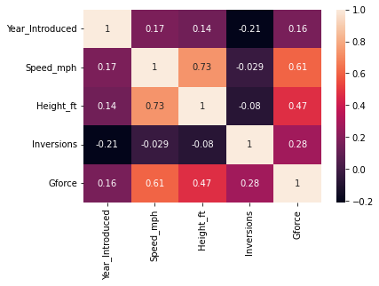
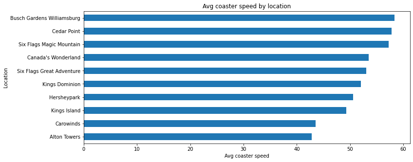

```python
import pandas as pd
import numpy as np
import matplotlib.pylab as plt
import seaborn as sns

# plt.style.use('ggplot')
pd.options.display.max_columns = 200
```


```python
df = pd.read_csv('coaster_db.csv')
```

# DATA UNDERSTANDING


```python
# get no. of rows and cols data
df.shape
```


    (1087, 56)


```python
# get the first 5 rows
df.head(5)
```


<div>
<style scoped>
    .dataframe tbody tr th:only-of-type {
        vertical-align: middle;
    }

    .dataframe tbody tr th {
        vertical-align: top;
    }

    .dataframe thead th {
        text-align: right;
    }
</style>
<table border="1" class="dataframe">
  <thead>
    <tr style="text-align: right;">
      <th></th>
      <th>coaster_name</th>
      <th>Length</th>
      <th>Speed</th>
      <th>Location</th>
      <th>Status</th>
      <th>Opening date</th>
      <th>Type</th>
      <th>Manufacturer</th>
      <th>Height restriction</th>
      <th>Model</th>
      <th>Height</th>
      <th>Inversions</th>
      <th>Lift/launch system</th>
      <th>Cost</th>
      <th>Trains</th>
      <th>Park section</th>
      <th>Duration</th>
      <th>Capacity</th>
      <th>G-force</th>
      <th>Designer</th>
      <th>Max vertical angle</th>
      <th>Drop</th>
      <th>Soft opening date</th>
      <th>Fast Lane available</th>
      <th>Replaced</th>
      <th>Track layout</th>
      <th>Fastrack available</th>
      <th>Soft opening date.1</th>
      <th>Closing date</th>
      <th>Opened</th>
      <th>Replaced by</th>
      <th>Website</th>
      <th>Flash Pass Available</th>
      <th>Must transfer from wheelchair</th>
      <th>Theme</th>
      <th>Single rider line available</th>
      <th>Restraint Style</th>
      <th>Flash Pass available</th>
      <th>Acceleration</th>
      <th>Restraints</th>
      <th>Name</th>
      <th>year_introduced</th>
      <th>latitude</th>
      <th>longitude</th>
      <th>Type_Main</th>
      <th>opening_date_clean</th>
      <th>speed1</th>
      <th>speed2</th>
      <th>speed1_value</th>
      <th>speed1_unit</th>
      <th>speed_mph</th>
      <th>height_value</th>
      <th>height_unit</th>
      <th>height_ft</th>
      <th>Inversions_clean</th>
      <th>Gforce_clean</th>
    </tr>
  </thead>
  <tbody>
    <tr>
      <th>0</th>
      <td>Switchback Railway</td>
      <td>600 ft (180 m)</td>
      <td>6 mph (9.7 km/h)</td>
      <td>Coney Island</td>
      <td>Removed</td>
      <td>June 16, 1884</td>
      <td>Wood</td>
      <td>LaMarcus Adna Thompson</td>
      <td>NaN</td>
      <td>Lift Packed</td>
      <td>50 ft (15 m)</td>
      <td>NaN</td>
      <td>gravity</td>
      <td>NaN</td>
      <td>NaN</td>
      <td>Coney Island Cyclone Site</td>
      <td>1:00</td>
      <td>1600 riders per hour</td>
      <td>2.9</td>
      <td>LaMarcus Adna Thompson</td>
      <td>30°</td>
      <td>43 ft (13 m)</td>
      <td>NaN</td>
      <td>NaN</td>
      <td>NaN</td>
      <td>Gravity pulled coaster</td>
      <td>NaN</td>
      <td>NaN</td>
      <td>NaN</td>
      <td>NaN</td>
      <td>NaN</td>
      <td>NaN</td>
      <td>NaN</td>
      <td>NaN</td>
      <td>NaN</td>
      <td>NaN</td>
      <td>NaN</td>
      <td>NaN</td>
      <td>NaN</td>
      <td>NaN</td>
      <td>NaN</td>
      <td>1884</td>
      <td>40.5740</td>
      <td>-73.9780</td>
      <td>Wood</td>
      <td>1884-06-16</td>
      <td>6 mph</td>
      <td>9.7 km/h</td>
      <td>6.0</td>
      <td>mph</td>
      <td>6.0</td>
      <td>50.0</td>
      <td>ft</td>
      <td>NaN</td>
      <td>0</td>
      <td>2.9</td>
    </tr>
    <tr>
      <th>1</th>
      <td>Flip Flap Railway</td>
      <td>NaN</td>
      <td>NaN</td>
      <td>Sea Lion Park</td>
      <td>Removed</td>
      <td>1895</td>
      <td>Wood</td>
      <td>Lina Beecher</td>
      <td>NaN</td>
      <td>NaN</td>
      <td>NaN</td>
      <td>1.0</td>
      <td>NaN</td>
      <td>NaN</td>
      <td>a single car. Riders are arranged 1 across in ...</td>
      <td>NaN</td>
      <td>NaN</td>
      <td>NaN</td>
      <td>12</td>
      <td>Lina Beecher</td>
      <td>NaN</td>
      <td>NaN</td>
      <td>NaN</td>
      <td>NaN</td>
      <td>NaN</td>
      <td>NaN</td>
      <td>NaN</td>
      <td>NaN</td>
      <td>1902</td>
      <td>NaN</td>
      <td>NaN</td>
      <td>NaN</td>
      <td>NaN</td>
      <td>NaN</td>
      <td>NaN</td>
      <td>NaN</td>
      <td>NaN</td>
      <td>NaN</td>
      <td>NaN</td>
      <td>NaN</td>
      <td>NaN</td>
      <td>1895</td>
      <td>40.5780</td>
      <td>-73.9790</td>
      <td>Wood</td>
      <td>1895-01-01</td>
      <td>NaN</td>
      <td>NaN</td>
      <td>NaN</td>
      <td>NaN</td>
      <td>NaN</td>
      <td>NaN</td>
      <td>NaN</td>
      <td>NaN</td>
      <td>1</td>
      <td>12.0</td>
    </tr>
    <tr>
      <th>2</th>
      <td>Switchback Railway (Euclid Beach Park)</td>
      <td>NaN</td>
      <td>NaN</td>
      <td>Cleveland, Ohio, United States</td>
      <td>Closed</td>
      <td>NaN</td>
      <td>Other</td>
      <td>NaN</td>
      <td>NaN</td>
      <td>NaN</td>
      <td>NaN</td>
      <td>NaN</td>
      <td>NaN</td>
      <td>NaN</td>
      <td>NaN</td>
      <td>NaN</td>
      <td>NaN</td>
      <td>NaN</td>
      <td>NaN</td>
      <td>NaN</td>
      <td>NaN</td>
      <td>NaN</td>
      <td>NaN</td>
      <td>NaN</td>
      <td>NaN</td>
      <td>NaN</td>
      <td>NaN</td>
      <td>NaN</td>
      <td>NaN</td>
      <td>1895</td>
      <td>NaN</td>
      <td>NaN</td>
      <td>NaN</td>
      <td>NaN</td>
      <td>NaN</td>
      <td>NaN</td>
      <td>NaN</td>
      <td>NaN</td>
      <td>NaN</td>
      <td>NaN</td>
      <td>NaN</td>
      <td>1896</td>
      <td>41.5800</td>
      <td>-81.5700</td>
      <td>Other</td>
      <td>NaN</td>
      <td>NaN</td>
      <td>NaN</td>
      <td>NaN</td>
      <td>NaN</td>
      <td>NaN</td>
      <td>NaN</td>
      <td>NaN</td>
      <td>NaN</td>
      <td>0</td>
      <td>NaN</td>
    </tr>
    <tr>
      <th>3</th>
      <td>Loop the Loop (Coney Island)</td>
      <td>NaN</td>
      <td>NaN</td>
      <td>Other</td>
      <td>Removed</td>
      <td>1901</td>
      <td>Steel</td>
      <td>Edwin Prescott</td>
      <td>NaN</td>
      <td>NaN</td>
      <td>NaN</td>
      <td>1.0</td>
      <td>NaN</td>
      <td>NaN</td>
      <td>a single car. Riders are arranged 2 across in ...</td>
      <td>NaN</td>
      <td>NaN</td>
      <td>NaN</td>
      <td>NaN</td>
      <td>Edward A. Green</td>
      <td>NaN</td>
      <td>NaN</td>
      <td>NaN</td>
      <td>NaN</td>
      <td>Switchback Railway</td>
      <td>NaN</td>
      <td>NaN</td>
      <td>NaN</td>
      <td>1910</td>
      <td>NaN</td>
      <td>Giant Racer</td>
      <td>NaN</td>
      <td>NaN</td>
      <td>NaN</td>
      <td>NaN</td>
      <td>NaN</td>
      <td>NaN</td>
      <td>NaN</td>
      <td>NaN</td>
      <td>NaN</td>
      <td>NaN</td>
      <td>1901</td>
      <td>40.5745</td>
      <td>-73.9780</td>
      <td>Steel</td>
      <td>1901-01-01</td>
      <td>NaN</td>
      <td>NaN</td>
      <td>NaN</td>
      <td>NaN</td>
      <td>NaN</td>
      <td>NaN</td>
      <td>NaN</td>
      <td>NaN</td>
      <td>1</td>
      <td>NaN</td>
    </tr>
    <tr>
      <th>4</th>
      <td>Loop the Loop (Young's Pier)</td>
      <td>NaN</td>
      <td>NaN</td>
      <td>Other</td>
      <td>Removed</td>
      <td>1901</td>
      <td>Steel</td>
      <td>Edwin Prescott</td>
      <td>NaN</td>
      <td>NaN</td>
      <td>NaN</td>
      <td>1.0</td>
      <td>NaN</td>
      <td>NaN</td>
      <td>NaN</td>
      <td>NaN</td>
      <td>NaN</td>
      <td>NaN</td>
      <td>NaN</td>
      <td>Edward A. Green</td>
      <td>NaN</td>
      <td>NaN</td>
      <td>NaN</td>
      <td>NaN</td>
      <td>NaN</td>
      <td>NaN</td>
      <td>NaN</td>
      <td>NaN</td>
      <td>1912</td>
      <td>NaN</td>
      <td>NaN</td>
      <td>NaN</td>
      <td>NaN</td>
      <td>NaN</td>
      <td>NaN</td>
      <td>NaN</td>
      <td>NaN</td>
      <td>NaN</td>
      <td>NaN</td>
      <td>NaN</td>
      <td>NaN</td>
      <td>1901</td>
      <td>39.3538</td>
      <td>-74.4342</td>
      <td>Steel</td>
      <td>1901-01-01</td>
      <td>NaN</td>
      <td>NaN</td>
      <td>NaN</td>
      <td>NaN</td>
      <td>NaN</td>
      <td>NaN</td>
      <td>NaN</td>
      <td>NaN</td>
      <td>1</td>
      <td>NaN</td>
    </tr>
  </tbody>
</table>
</div>


```python
# get all column names
df.columns
```


    Index(['coaster_name', 'Length', 'Speed', 'Location', 'Status', 'Opening date',
           'Type', 'Manufacturer', 'Height restriction', 'Model', 'Height',
           'Inversions', 'Lift/launch system', 'Cost', 'Trains', 'Park section',
           'Duration', 'Capacity', 'G-force', 'Designer', 'Max vertical angle',
           'Drop', 'Soft opening date', 'Fast Lane available', 'Replaced',
           'Track layout', 'Fastrack available', 'Soft opening date.1',
           'Closing date', 'Opened', 'Replaced by', 'Website',
           'Flash Pass Available', 'Must transfer from wheelchair', 'Theme',
           'Single rider line available', 'Restraint Style',
           'Flash Pass available', 'Acceleration', 'Restraints', 'Name',
           'year_introduced', 'latitude', 'longitude', 'Type_Main',
           'opening_date_clean', 'speed1', 'speed2', 'speed1_value', 'speed1_unit',
           'speed_mph', 'height_value', 'height_unit', 'height_ft',
           'Inversions_clean', 'Gforce_clean'],
          dtype='object')


```python
# get type of each column
df.dtypes
```


    coaster_name                      object
    Length                            object
    Speed                             object
    Location                          object
    Status                            object
    Opening date                      object
    Type                              object
    Manufacturer                      object
    Height restriction                object
    Model                             object
    Height                            object
    Inversions                       float64
    Lift/launch system                object
    Cost                              object
    Trains                            object
    Park section                      object
    Duration                          object
    Capacity                          object
    G-force                           object
    Designer                          object
    Max vertical angle                object
    Drop                              object
    Soft opening date                 object
    Fast Lane available               object
    Replaced                          object
    Track layout                      object
    Fastrack available                object
    Soft opening date.1               object
    Closing date                      object
    Opened                            object
    Replaced by                       object
    Website                           object
    Flash Pass Available              object
    Must transfer from wheelchair     object
    Theme                             object
    Single rider line available       object
    Restraint Style                   object
    Flash Pass available              object
    Acceleration                      object
    Restraints                        object
    Name                              object
    year_introduced                    int64
    latitude                         float64
    longitude                        float64
    Type_Main                         object
    opening_date_clean                object
    speed1                            object
    speed2                            object
    speed1_value                     float64
    speed1_unit                       object
    speed_mph                        float64
    height_value                     float64
    height_unit                       object
    height_ft                        float64
    Inversions_clean                   int64
    Gforce_clean                     float64
    dtype: object


```python
# shows info and statistics of the numeric data in our dataset
df.describe()
```


<div>
<style scoped>
    .dataframe tbody tr th:only-of-type {
        vertical-align: middle;
    }

    .dataframe tbody tr th {
        vertical-align: top;
    }

    .dataframe thead th {
        text-align: right;
    }
</style>
<table border="1" class="dataframe">
  <thead>
    <tr style="text-align: right;">
      <th></th>
      <th>Inversions</th>
      <th>year_introduced</th>
      <th>latitude</th>
      <th>longitude</th>
      <th>speed1_value</th>
      <th>speed_mph</th>
      <th>height_value</th>
      <th>height_ft</th>
      <th>Inversions_clean</th>
      <th>Gforce_clean</th>
    </tr>
  </thead>
  <tbody>
    <tr>
      <th>count</th>
      <td>932.000000</td>
      <td>1087.000000</td>
      <td>812.000000</td>
      <td>812.000000</td>
      <td>937.000000</td>
      <td>937.000000</td>
      <td>965.000000</td>
      <td>171.000000</td>
      <td>1087.000000</td>
      <td>362.000000</td>
    </tr>
    <tr>
      <th>mean</th>
      <td>1.547210</td>
      <td>1994.986201</td>
      <td>38.373484</td>
      <td>-41.595373</td>
      <td>53.850374</td>
      <td>48.617289</td>
      <td>89.575171</td>
      <td>101.996491</td>
      <td>1.326587</td>
      <td>3.824006</td>
    </tr>
    <tr>
      <th>std</th>
      <td>2.114073</td>
      <td>23.475248</td>
      <td>15.516596</td>
      <td>72.285227</td>
      <td>23.385518</td>
      <td>16.678031</td>
      <td>136.246444</td>
      <td>67.329092</td>
      <td>2.030854</td>
      <td>0.989998</td>
    </tr>
    <tr>
      <th>min</th>
      <td>0.000000</td>
      <td>1884.000000</td>
      <td>-48.261700</td>
      <td>-123.035700</td>
      <td>5.000000</td>
      <td>5.000000</td>
      <td>4.000000</td>
      <td>13.100000</td>
      <td>0.000000</td>
      <td>0.800000</td>
    </tr>
    <tr>
      <th>25%</th>
      <td>0.000000</td>
      <td>1989.000000</td>
      <td>35.031050</td>
      <td>-84.552200</td>
      <td>40.000000</td>
      <td>37.300000</td>
      <td>44.000000</td>
      <td>51.800000</td>
      <td>0.000000</td>
      <td>3.400000</td>
    </tr>
    <tr>
      <th>50%</th>
      <td>0.000000</td>
      <td>2000.000000</td>
      <td>40.289800</td>
      <td>-76.653600</td>
      <td>50.000000</td>
      <td>49.700000</td>
      <td>79.000000</td>
      <td>91.200000</td>
      <td>0.000000</td>
      <td>4.000000</td>
    </tr>
    <tr>
      <th>75%</th>
      <td>3.000000</td>
      <td>2010.000000</td>
      <td>44.799600</td>
      <td>2.778100</td>
      <td>63.000000</td>
      <td>58.000000</td>
      <td>113.000000</td>
      <td>131.200000</td>
      <td>2.000000</td>
      <td>4.500000</td>
    </tr>
    <tr>
      <th>max</th>
      <td>14.000000</td>
      <td>2022.000000</td>
      <td>63.230900</td>
      <td>153.426500</td>
      <td>240.000000</td>
      <td>149.100000</td>
      <td>3937.000000</td>
      <td>377.300000</td>
      <td>14.000000</td>
      <td>12.000000</td>
    </tr>
  </tbody>
</table>
</div>


# DATA PREPARATION


```python
##### remove unnecessary columns 

# approach 1 - subsetting
df = df[['coaster_name', 'Location', 'Status', 'Manufacturer', 'year_introduced', 'latitude', 'longitude', 
    'Type_Main', 'opening_date_clean', 'speed_mph', 'height_ft', 'Inversions_clean', 'Gforce_clean']].copy()


# approach 2
# df.drop(['Opened'], axis=1)
```


```python
df.dtypes
```


    coaster_name                  object
    Location                      object
    Status                        object
    Manufacturer                  object
    year_introduced                int64
    latitude                     float64
    longitude                    float64
    Type_Main                     object
    opening_date_clean    datetime64[ns]
    speed_mph                    float64
    height_ft                    float64
    Inversions_clean               int64
    Gforce_clean                 float64
    dtype: object


```python
df['opening_date_clean'] = pd.to_datetime(df['opening_date_clean'])
```


```python
# rename columns
df = df.rename(columns={
    'coaster_name': 'Coaster_Name',
    'year_introduced': 'Year_Introduced',
    'opening_date_clean': 'Opening_Date',
    'speed_mph': 'Speed_mph',
    'height_ft': 'Height_ft',
    'Inversions_clean': 'Inversions',
    'Gforce_clean': 'Gforce'
})
```


```python
# find no. of missing values
df.isna().sum()
```


    Coaster_Name         0
    Location             0
    Status             213
    Manufacturer        59
    Year_Introduced      0
    latitude           275
    longitude          275
    Type_Main            0
    Opening_Date       250
    Speed_mph          150
    Height_ft          916
    Inversions           0
    Gforce             725
    dtype: int64


```python
# find duplicates 
df.loc[df.duplicated()]
```


<div>
<style scoped>
    .dataframe tbody tr th:only-of-type {
        vertical-align: middle;
    }

    .dataframe tbody tr th {
        vertical-align: top;
    }

    .dataframe thead th {
        text-align: right;
    }
</style>
<table border="1" class="dataframe">
  <thead>
    <tr style="text-align: right;">
      <th></th>
      <th>Coaster_Name</th>
      <th>Location</th>
      <th>Status</th>
      <th>Manufacturer</th>
      <th>Year_Introduced</th>
      <th>latitude</th>
      <th>longitude</th>
      <th>Type_Main</th>
      <th>Opening_Date</th>
      <th>Speed_mph</th>
      <th>Height_ft</th>
      <th>Inversions</th>
      <th>Gforce</th>
    </tr>
  </thead>
  <tbody>
  </tbody>
</table>
</div>


```python
# find duplicated coaster name
df.loc[df.duplicated(subset=['Coaster_Name'])].head(5)
```


<div>
<style scoped>
    .dataframe tbody tr th:only-of-type {
        vertical-align: middle;
    }

    .dataframe tbody tr th {
        vertical-align: top;
    }

    .dataframe thead th {
        text-align: right;
    }
</style>
<table border="1" class="dataframe">
  <thead>
    <tr style="text-align: right;">
      <th></th>
      <th>Coaster_Name</th>
      <th>Location</th>
      <th>Status</th>
      <th>Manufacturer</th>
      <th>Year_Introduced</th>
      <th>latitude</th>
      <th>longitude</th>
      <th>Type_Main</th>
      <th>Opening_Date</th>
      <th>Speed_mph</th>
      <th>Height_ft</th>
      <th>Inversions</th>
      <th>Gforce</th>
    </tr>
  </thead>
  <tbody>
    <tr>
      <th>43</th>
      <td>Crystal Beach Cyclone</td>
      <td>Crystal Beach Park</td>
      <td>Removed</td>
      <td>Traver Engineering</td>
      <td>1927</td>
      <td>42.8617</td>
      <td>-79.0598</td>
      <td>Wood</td>
      <td>1926-01-01</td>
      <td>60.0</td>
      <td>NaN</td>
      <td>0</td>
      <td>4.0</td>
    </tr>
    <tr>
      <th>60</th>
      <td>Derby Racer</td>
      <td>Revere Beach</td>
      <td>Removed</td>
      <td>Fred W. Pearce</td>
      <td>1937</td>
      <td>42.4200</td>
      <td>-70.9860</td>
      <td>Wood</td>
      <td>1911-01-01</td>
      <td>NaN</td>
      <td>NaN</td>
      <td>0</td>
      <td>NaN</td>
    </tr>
    <tr>
      <th>61</th>
      <td>Blue Streak (Conneaut Lake)</td>
      <td>Conneaut Lake Park</td>
      <td>Closed</td>
      <td>NaN</td>
      <td>1938</td>
      <td>41.6349</td>
      <td>-80.3180</td>
      <td>Wood</td>
      <td>1938-05-23</td>
      <td>50.0</td>
      <td>NaN</td>
      <td>0</td>
      <td>NaN</td>
    </tr>
    <tr>
      <th>167</th>
      <td>Big Thunder Mountain Railroad</td>
      <td>Other</td>
      <td>NaN</td>
      <td>Arrow Development (California and Florida)Dyna...</td>
      <td>1980</td>
      <td>NaN</td>
      <td>NaN</td>
      <td>Steel</td>
      <td>NaT</td>
      <td>35.0</td>
      <td>NaN</td>
      <td>0</td>
      <td>NaN</td>
    </tr>
    <tr>
      <th>237</th>
      <td>Thunder Run (Canada's Wonderland)</td>
      <td>Canada's Wonderland</td>
      <td>Operating</td>
      <td>Mack Rides</td>
      <td>1986</td>
      <td>43.8427</td>
      <td>-79.5423</td>
      <td>Steel</td>
      <td>1981-05-23</td>
      <td>39.8</td>
      <td>32.8</td>
      <td>0</td>
      <td>NaN</td>
    </tr>
  </tbody>
</table>
</div>


```python
# checking an example duplicate
df.query("Coaster_Name == 'Crystal Beach Cyclone'")
```


<div>
<style scoped>
    .dataframe tbody tr th:only-of-type {
        vertical-align: middle;
    }

    .dataframe tbody tr th {
        vertical-align: top;
    }

    .dataframe thead th {
        text-align: right;
    }
</style>
<table border="1" class="dataframe">
  <thead>
    <tr style="text-align: right;">
      <th></th>
      <th>Coaster_Name</th>
      <th>Location</th>
      <th>Status</th>
      <th>Manufacturer</th>
      <th>Year_Introduced</th>
      <th>latitude</th>
      <th>longitude</th>
      <th>Type_Main</th>
      <th>Opening_Date</th>
      <th>Speed_mph</th>
      <th>Height_ft</th>
      <th>Inversions</th>
      <th>Gforce</th>
    </tr>
  </thead>
  <tbody>
    <tr>
      <th>39</th>
      <td>Crystal Beach Cyclone</td>
      <td>Crystal Beach Park</td>
      <td>Removed</td>
      <td>Traver Engineering</td>
      <td>1926</td>
      <td>42.8617</td>
      <td>-79.0598</td>
      <td>Wood</td>
      <td>1926-01-01</td>
      <td>60.0</td>
      <td>NaN</td>
      <td>0</td>
      <td>4.0</td>
    </tr>
    <tr>
      <th>43</th>
      <td>Crystal Beach Cyclone</td>
      <td>Crystal Beach Park</td>
      <td>Removed</td>
      <td>Traver Engineering</td>
      <td>1927</td>
      <td>42.8617</td>
      <td>-79.0598</td>
      <td>Wood</td>
      <td>1926-01-01</td>
      <td>60.0</td>
      <td>NaN</td>
      <td>0</td>
      <td>4.0</td>
    </tr>
  </tbody>
</table>
</div>


```python
# non-duplicaet rows wrt three cols
df = df.loc[~df.duplicated(subset=['Coaster_Name', 'Location', 'Opening_Date'])].reset_index(drop=True).copy()
```

# FEATURE UNDERSTANDING


```python
# each year hoiw many RCs were introduced
df['Year_Introduced'].value_counts() 
```


    1999    46
    2000    45
    1998    30
    2001    29
    2002    28
            ..
    1956     1
    1959     1
    1961     1
    1895     1
    1884     1
    Name: Year_Introduced, Length: 101, dtype: int64


```python
ax = df['Year_Introduced'].value_counts().head(10).plot(kind='bar', title='Top years Coasters introduced')
ax.set_xlabel('Year Introduced')
ax.set_ylabel('Count')
```


    Text(0, 0.5, 'Count')


    

    


```python
ax1 = df['Speed_mph'].plot(kind='hist', bins=20, title='Coster Speeds (mph)')
ax1.set_xlabel('Speed (mph)')
```


    Text(0.5, 0, 'Speed (mph)')


    

    


```python
ax2 = df['Speed_mph'].plot(kind='kde', title='Coster Speeds (mph)')
ax2.set_xlabel('Speed (mph)')
```


    Text(0.5, 0, 'Speed (mph)')


    

    


# FEATURE RELATIONSHIPS


```python
df.plot(kind='scatter', x='Speed_mph', y='Height_ft', title='Coaster speed vs. height')
plt.show()
```


    

    


```python
sns.scatterplot(x='Speed_mph', y='Height_ft', hue='Year_Introduced', data=df)
```


    <AxesSubplot:xlabel='Speed_mph', ylabel='Height_ft'>


    

    


```python
sns.pairplot(df, vars=['Year_Introduced', 'Speed_mph', 'Height_ft', 'Inversions', 'Gforce'], hue='Type_Main')
plt.show()
```


    

    


```python
df_corr = df[['Year_Introduced', 'Speed_mph', 'Height_ft', 'Inversions', 'Gforce']].dropna().corr()
df_corr
```


<div>
<style scoped>
    .dataframe tbody tr th:only-of-type {
        vertical-align: middle;
    }

    .dataframe tbody tr th {
        vertical-align: top;
    }

    .dataframe thead th {
        text-align: right;
    }
</style>
<table border="1" class="dataframe">
  <thead>
    <tr style="text-align: right;">
      <th></th>
      <th>Year_Introduced</th>
      <th>Speed_mph</th>
      <th>Height_ft</th>
      <th>Inversions</th>
      <th>Gforce</th>
    </tr>
  </thead>
  <tbody>
    <tr>
      <th>Year_Introduced</th>
      <td>1.000000</td>
      <td>0.171978</td>
      <td>0.135413</td>
      <td>-0.209887</td>
      <td>0.160247</td>
    </tr>
    <tr>
      <th>Speed_mph</th>
      <td>0.171978</td>
      <td>1.000000</td>
      <td>0.733999</td>
      <td>-0.028705</td>
      <td>0.607383</td>
    </tr>
    <tr>
      <th>Height_ft</th>
      <td>0.135413</td>
      <td>0.733999</td>
      <td>1.000000</td>
      <td>-0.079736</td>
      <td>0.466482</td>
    </tr>
    <tr>
      <th>Inversions</th>
      <td>-0.209887</td>
      <td>-0.028705</td>
      <td>-0.079736</td>
      <td>1.000000</td>
      <td>0.275991</td>
    </tr>
    <tr>
      <th>Gforce</th>
      <td>0.160247</td>
      <td>0.607383</td>
      <td>0.466482</td>
      <td>0.275991</td>
      <td>1.000000</td>
    </tr>
  </tbody>
</table>
</div>


```python
sns.heatmap(df_corr)
```


    <AxesSubplot:>


    

    


```python
sns.heatmap(df_corr, annot=True)
```


    <AxesSubplot:>


    

    


# **** DATA INSIGHTS ****

## What are the locations with the fastest roller coasters (minimum of 10)?


```python
ax = df.query('Location != "Other"') \
.groupby('Location')['Speed_mph'] \
.agg(['mean', 'count']) \
.query('count >= 10') \
.sort_values('mean')['mean'] \
.plot(kind='barh', figsize=(12,5), title='Avg coaster speed by location')

ax.set_xlabel('Avg coaster speed')

plt.show()
```


    

    


```python

```
